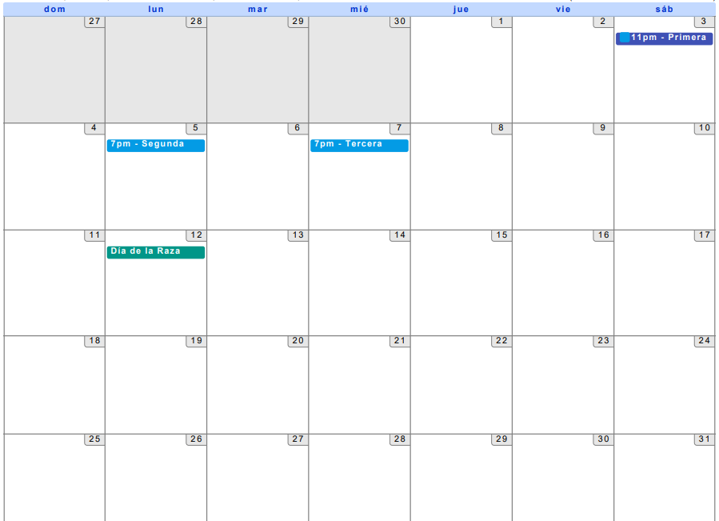
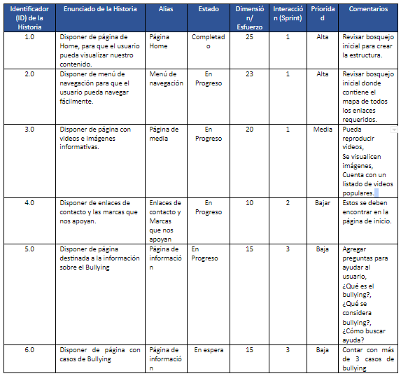

## Actividad preliminar. Retomando mi primer sprint

***

### Calendario De Reuniones:
Sábado 3 de octubre 2020, 11:00am, 11:30am, Duración 30 minutos.
Sábado 3 de octubre 2020, 7pm, 7:30pm, Duración 30 minutos.
Sábado 3 de octubre 2020, 7pm, 7:30pm, Duración 30 minutos.

Calendario: 

***
## Primera reunión 

#### Fecha: Sábado 3 de Octubre, Duración 30 minutos.

Repartición de roles:     

| Product Owner (PO)       | Scrum Master (SM)          | Desarrollador  |
| ------------- |:-------------:| -----:|
| Elizabeth     | Mayra | Mayra |

*** 
### Proyecto: Creando un sueño, creando videojuegos
### Resultados personales.

* Como Scrum Master veo que algunas actividades requieren más tiempo por su complejidad y se les asigna más tiempo es decir la [Historia 04 y 05] se modificó la duración de sus sprints por lo que se dividirá en 2 sprints cada actividad, pasarán de tener 20 horas a 40 horas asignadas.

### Proyecto: PrevenciónDelAcoso.com
### Resultados personales.

* Como Product Owner sugerí que para poder profundizar más en la transmisión de la concientización del acoso se asignará más tiempo para la búsqueda y recolección de imágenes para transmitir de una forma más eficaz el mensaje de concientización acerca del bullying, a la [Historia 3.0] de 15 horas a 20 horas.

***

## Segunda reunión
Fecha: Lunes 5 de Octubre, Duración 30 minutos.

Repartición de roles:     

| Product Owner (PO)       | Scrum Master (SM)          | Desarrollador  |
| ------------- |:-------------:| -----:|
| Mayra     | Elizabeth | Elizabeth |

### Proyecto: Creando un sueño, creando videojuegos
### Resultados personales.

* El Product Owner decidió que un foro sería suficiente para la comunicación y la interacción entre usuarios, por lo cual modifica la [Historia 4] eliminando los chads.

### Proyecto: PrevenciónDelAcoso.com
### Resultados personales.

* Tanto Product Owner y Scrum Master comentaron que las Historias de este día se realizaron al corriente de lo esperado no se realizó ningún inconveniente todo va en forma, hasta esta junta el Backlog permanece intacto.

***

## Tercera reunión
### Fecha: Miércoles 7 de Octubre, Duración 30 minutos.

Repartición de roles:     

| Product Owner (PO)       | Scrum Master (SM)          | Desarrollador  |
| ------------- |:-------------:| -----:|
| Elizabeth     | Mayra | Mayra |

***

### Proyecto: Creando un sueño, creando videojuegos
### Resultados personales.

* Scrum Master decidió por un diseño simple para el login, que contiene la historia 4

### Proyecto: PrevenciónDelAcoso.com
### Resultados personales.

* Product Owner y Scrum Master decidió que videos se implementaran y cuál sería listado de videos populares de la [Historia 3.0], y se observó que la [Historia 2] requiere más tiempo y se asignó 3 horas más.

***

### Proyecto: PrevenciónDelAcoso.com

### Product backlog:

